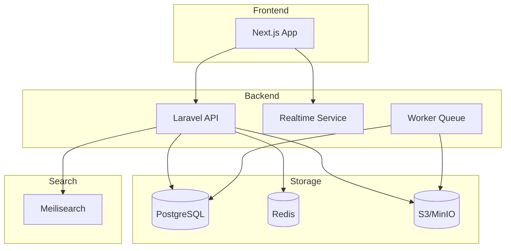
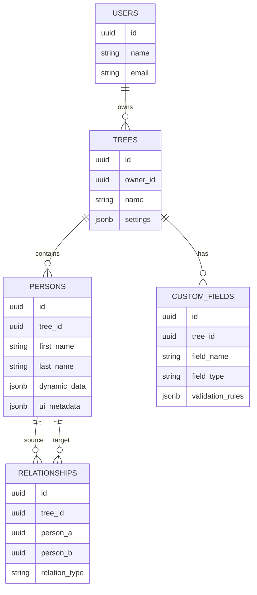
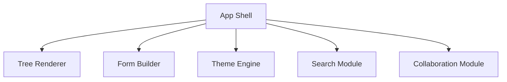
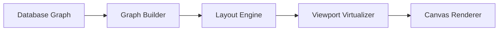
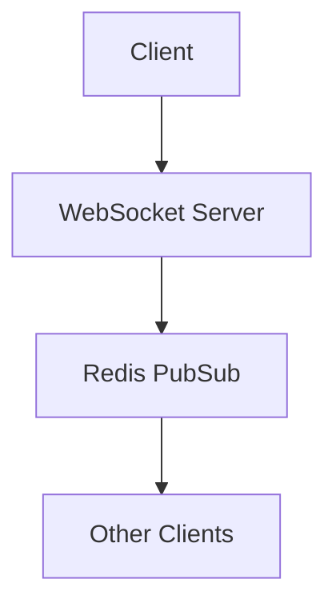

# Product Requirements Document (PRD)
# Customizable Family Tree Platform

---

# 1. Product Overview

## Product Name
Kinova — Customizable Family Tree Platform

---

## Product Vision

Membangun platform family tree modern yang:
- fleksibel terhadap struktur keluarga apa pun
- customizable dari sisi data & UI
- scalable untuk keluarga besar
- collaborative dan realtime
- dapat digunakan untuk dokumentasi sejarah keluarga lintas generasi

---

# 2. Problem Statement

Sebagian besar aplikasi family tree saat ini memiliki keterbatasan:

| Masalah | Dampak |
|---|---|
| Struktur keluarga rigid | tidak cocok untuk budaya tertentu |
| Custom field terbatas | informasi keluarga tidak lengkap |
| UI tidak customizable | sulit menyesuaikan budaya/family style |
| Tidak realtime collaborative | sulit edit bersama |
| Tidak scalable | tree besar menjadi lambat |
| Tidak mendukung media & timeline | kehilangan konteks sejarah |

---

# 3. Goals

## Business Goals

- Membuat platform genealogy modern
- Menjadi SaaS family heritage platform
- Mendukung multi-tenant
- Mendukung monetization via premium customization

---

## User Goals

User dapat:
- membuat family tree tanpa batas
- mengatur field data sendiri
- mengubah tampilan tree
- berkolaborasi dengan anggota keluarga
- menyimpan sejarah keluarga lintas generasi

---

# 4. Target Users

## Primary Users

### Family Historian
Orang yang mendokumentasikan sejarah keluarga.

### Clan / Marga Administrator
Mengelola silsilah keluarga besar.

### Cultural Communities
Komunitas adat / kerajaan / trah.

---

## Secondary Users

- sekolah sejarah
- peneliti genealogy
- komunitas budaya
- organisasi keluarga

---

# 5. Scope

# MVP Scope

## Included

### Authentication
- register/login
- invitation system
- role permission

### Family Tree
- create tree
- add/edit person
- create relationship
- visualize tree

### Customization
- custom fields
- theme customization
- layout selection

### Media
- upload photo
- upload document

### Search
- search family member

---

## Excluded (Phase 2+)

- AI recommendation
- DNA integration
- realtime collaboration
- offline mode
- mobile app native

---

# 6. Functional Requirements

# 6.1 Authentication & User Management

## Features

### User Registration
User dapat membuat akun menggunakan:
- email/password
- Google OAuth

---

### Login
- JWT/session auth
- remember me

---

### RBAC

| Role | Permissions |
|---|---|
| Owner | full access |
| Editor | edit tree |
| Viewer | read-only |
| Guest | limited access |

---

# 6.2 Family Tree Management

## Create Tree

User dapat:
- membuat tree baru
- memilih template
- memilih layout default

---

## Person Management

### Standard Fields

| Field | Type |
|---|---|
| first_name | string |
| last_name | string |
| birth_date | date |
| death_date | date |
| gender | enum |
| biography | text |

---

## Dynamic Fields

User dapat menambahkan:
- text field
- date field
- dropdown
- tag
- file
- image

---

## Relationship Management

Supported relationships:

| Type |
|---|
| parent |
| spouse |
| sibling |
| adopted |
| guardian |
| step_parent |

---

# 6.3 Visualization Engine

## Layout Types

### Vertical Tree
Traditional hierarchy.

### Horizontal Tree

### Radial Tree

### Clan Layout

---

## Node Customization

User dapat mengubah:
- warna
- ukuran
- border
- photo shape
- typography

---

## Zoom & Navigation

- zoom in/out
- drag canvas
- mini map

---

# 6.4 Media Management

## Supported Media

| Type |
|---|
| image |
| video |
| audio |
| document |

---

## Features

- upload
- preview
- compression
- CDN delivery

---

# 6.5 Search

## Search Features

Search berdasarkan:
- nama
- generasi
- lokasi
- hubungan keluarga

---

# 6.6 Collaboration

(Phase 2)

## Features

- realtime editing
- activity feed
- comment system
- edit history

---

# 7. Non-Functional Requirements

# Performance

| Requirement | Target |
|---|---|
| Initial load | < 3s |
| Tree rendering | < 2s |
| Search response | < 500ms |
| API latency | < 300ms |

---

# Scalability

System harus mendukung:
- 100k users
- 10k nodes per tree
- concurrent editing

---

# Security

- JWT auth
- CSRF protection
- encrypted storage
- RBAC enforcement
- audit logging

---

# Availability

| Requirement | Target |
|---|---|
| uptime | 99.9% |

---

# Accessibility

- keyboard navigation
- screen reader support
- color contrast compliance

---

# 8. Technical Architecture

# High-Level Architecture



---

# 9. Database Design

# Core ERD



---

# 10. API Design

## Tree APIs

```http
GET /api/trees
POST /api/trees
GET /api/trees/{id}
```

---

## Person APIs

```http
POST /api/persons
PUT /api/persons/{id}
DELETE /api/persons/{id}
```

---

## Relationship APIs

```http
POST /api/relationships
DELETE /api/relationships/{id}
```

---

# 11. Frontend Architecture

## Frontend Modules



---

# 12. Customization Engine

## Theme Schema Example

```json
{
  "theme": "royal_dark",
  "node": {
    "shape": "card",
    "border_radius": 16,
    "font": "serif"
  },
  "edge": {
    "style": "curved",
    "width": 2
  }
}
```

---

# 13. Rendering Engine

## Render Pipeline



---

# 14. Realtime Architecture

(Phase 2)



---

# 15. Queue & Worker System

## Async Jobs

| Job |
|---|
| image compression |
| thumbnail generation |
| search indexing |
| export PDF |
| notification |

---

# 16. Search System

## Search Pipeline


---

# 17. Future Features

# AI Assistant

AI membantu:
- mendeteksi duplicate person
- merekomendasikan hubungan keluarga
- auto-generate biography

---

# Historical Timeline

Menampilkan:
- pernikahan
- kelahiran
- kematian
- migrasi keluarga

---

# DNA Integration

Integrasi:
- GEDCOM
- DNA ancestry services

---

# 18. Risks & Challenges

| Challenge | Impact |
|---|---|
| graph rendering complexity | high |
| large family performance | high |
| relationship edge cases | medium |
| realtime sync conflicts | high |
| dynamic schema validation | medium |

---

# 19. Success Metrics

# Product Metrics

| Metric | Target |
|---|---|
| monthly active users | 10k |
| avg tree size | 300 persons |
| retention | >40% |
| avg session time | >15 min |

---

# Technical Metrics

| Metric | Target |
|---|---|
| render FPS | 60 FPS |
| API error rate | <1% |
| search accuracy | >95% |

---

# 20. Recommended Tech Stack

# Frontend

| Tech | Purpose |
|---|---|
| Next.js | web app |
| React Flow | graph rendering |
| TailwindCSS | styling |
| Zustand | state |

---

# Backend

| Tech | Purpose |
|---|---|
| Laravel | API |
| Reverb | websocket |
| Horizon | queue |

---

# Infrastructure

| Tech | Purpose |
|---|---|
| PostgreSQL | main DB |
| Redis | cache/pubsub |
| MinIO/S3 | media storage |
| Meilisearch | search |

---

# 21. Development Roadmap

# Phase 1 — MVP

Duration: 2–3 months

Features:
- auth
- CRUD person
- tree visualization
- relationships
- custom fields

---

# Phase 2 — Collaboration

Duration: 2 months

Features:
- realtime
- activity logs
- commenting
- sharing

---

# Phase 3 — Advanced System

Duration: 3 months

Features:
- AI assistant
- export system
- mobile responsive optimization
- public genealogy pages

---

# 22. Final Recommendation

Fokus utama sistem ini bukan CRUD.

Fokus sebenarnya adalah:

```text
Graph Visualization Platform
+
Dynamic Schema Engine
+
Custom UI Rendering System
```

Jika arsitektur awal salah (misalnya hanya parent-child relational biasa), maka:
- customization akan sulit
- rendering akan sulit
- scaling akan sulit
- future features akan mahal direfactor

Karena itu sejak awal:
- gunakan graph-oriented relationship
- gunakan JSONB dynamic schema