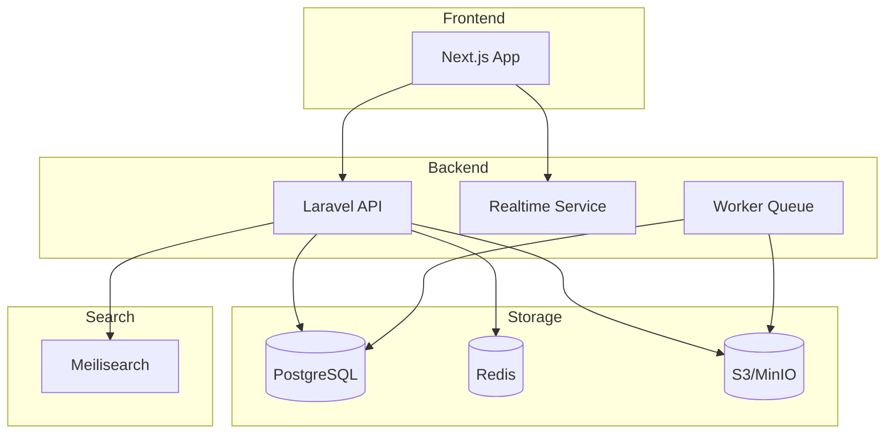
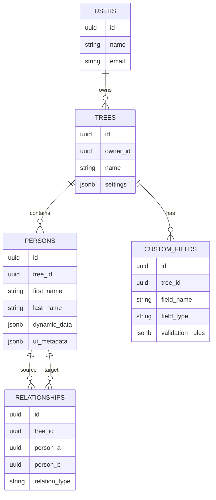
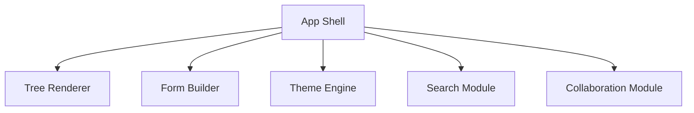
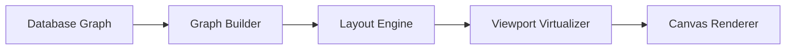
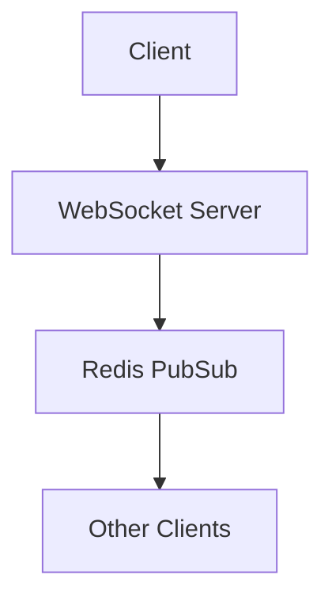

# Product Requirements Document (PRD)
# Customizable Family Tree Platform

---

# 1. Product Overview

## Product Name
Kinova — Customizable Family Tree Platform

---

## Product Vision

Membangun platform family tree modern yang:
- fleksibel terhadap struktur keluarga apa pun
- customizable dari sisi data & UI
- scalable untuk keluarga besar
- collaborative dan realtime
- dapat digunakan untuk dokumentasi sejarah keluarga lintas generasi

---

# 2. Problem Statement

Sebagian besar aplikasi family tree saat ini memiliki keterbatasan:

| Masalah | Dampak |
|---|---|
| Struktur keluarga rigid | tidak cocok untuk budaya tertentu |
| Custom field terbatas | informasi keluarga tidak lengkap |
| UI tidak customizable | sulit menyesuaikan budaya/family style |
| Tidak realtime collaborative | sulit edit bersama |
| Tidak scalable | tree besar menjadi lambat |
| Tidak mendukung media & timeline | kehilangan konteks sejarah |

---

# 3. Goals

## Business Goals

- Membuat platform genealogy modern
- Menjadi SaaS family heritage platform
- Mendukung multi-tenant
- Mendukung monetization via premium customization

---

## User Goals

User dapat:
- membuat family tree tanpa batas
- mengatur field data sendiri
- mengubah tampilan tree
- berkolaborasi dengan anggota keluarga
- menyimpan sejarah keluarga lintas generasi

---

# 4. Target Users

## Primary Users

### Family Historian
Orang yang mendokumentasikan sejarah keluarga.

### Clan / Marga Administrator
Mengelola silsilah keluarga besar.

### Cultural Communities
Komunitas adat / kerajaan / trah.

---

## Secondary Users

- sekolah sejarah
- peneliti genealogy
- komunitas budaya
- organisasi keluarga

---

# 5. Scope

# System Scope (All Phases Implemented)

## Included (Fully Implemented)

### Authentication & Authorization
- register/login (Sanctum Tokens)
- RBAC permission model (Owner, Editor, Viewer)
- Invitation and collaborator management system

### Family Tree Management
- create tree
- add/edit person (Debounced live canvas coordinates sync)
- create graph-based relationships
- visualize tree (React Flow with active Dark/Light warm-monochrome modes)
- Erase lineage (Erase tree with premium customized safe alerts)

### Customization & Schemas
- Dynamic custom fields (Unified JSONB payload blocks)
- Theme customization (Monochrome & Sage Green aesthetic accents)
- Layout configurations (Card sizing, line styles)

### Import & Export Archives (Restores & Backups)
- Full JSON export of profiles, relationships, custom fields, and canvas coordinates
- Full JSON import system with an automatic relational ID re-mapping engine

### Search & Discovery
- Quick family member fuzzy search across name and last name
- Node canvas tracking and view zoom centering

### Real-Time Collaboration & Syncing (Phase 2)
- SSE non-blocking stream synchronization using Redis queue polling
- WebSockets syncing utilizing Laravel Reverb & Laravel Echo delta updates

### Memoirs & Discussions
- Sliding Notion-style Ancestor Memoir drawer (biography, vitals, dynastic timelines)
- Collaborative comment threads on individual ancestor nodes
- Sliding Activity Audit Logs timeline feed of all database changes

### Public Genealogy Portal (Phase 3)
- Unauthenticated read-only viewport `/public/trees/[id]`
- Owner "Make Tree Public" toggle switch and single-click share link generator inside UI

---

## Excluded (Future Phase 4+)

- AI recommendation (Duplicate node detection and auto biography)
- DNA integration (GEDCOM/DNA ancestry uploads)
- Offline mode local caching
- Mobile app native client wrapper

---

# 6. Functional Requirements

# 6.1 Authentication & User Management

## Features

### User Registration
User dapat membuat akun menggunakan:
- email/password
- Google OAuth

---

### Login
- JWT/session auth
- remember me

---

### RBAC

| Role | Permissions |
|---|---|
| Owner | full access |
| Editor | edit tree |
| Viewer | read-only |
| Guest | limited access |

---

# 6.2 Family Tree Management

## Create Tree

User dapat:
- membuat tree baru
- memilih template
- memilih layout default

---

## Person Management

### Standard Fields

| Field | Type |
|---|---|
| first_name | string |
| last_name | string |
| birth_date | date |
| death_date | date |
| gender | enum |
| biography | text |

---

## Dynamic Fields

User dapat menambahkan:
- text field
- date field
- dropdown
- tag
- file
- image

---

## Relationship Management

Supported relationships:

| Type |
|---|
| parent |
| spouse |
| sibling |
| adopted |
| guardian |
| step_parent |

---

# 6.3 Visualization Engine

## Layout Types

### Vertical Tree
Traditional hierarchy.

### Horizontal Tree

### Radial Tree

### Clan Layout

---

## Node Customization

User dapat mengubah:
- warna
- ukuran
- border
- photo shape
- typography

---

## Zoom & Navigation

- zoom in/out
- drag canvas
- mini map

---

# 6.4 Media Management

## Supported Media

| Type |
|---|
| image |
| video |
| audio |
| document |

---

## Features

- upload
- preview
- compression
- CDN delivery

---

# 6.5 Search

## Search Features

Search berdasarkan:
- nama
- generasi
- lokasi
- hubungan keluarga

---

# 6.6 Collaboration [IMPLEMENTED]

Fully implemented real-time sync, audit feeds, and memoirs.

## Features

- **Real-Time Synchronized Canvas**: Canvas coordination drag operations and node details propagate live to other editors.
- **SSE Fallback Engine**: Employs an ultra-fast Redis LPOP queue to broadcast events via Server-Sent Events without locking the PHP application server.
- **WebSockets Broadcasting**: Integrated with Laravel Reverb as the primary socket dispatch mechanism.
- **Activity Log Audit Trail**: Renders a dedicated sidebar timeline documenting all creation, removal, and editing operations of nodes and lines.
- **Historical Memoirs Comments**: Research commentary threads on profile records so editors can exchange sources and historical evidence.

---

# 6.7 Import & Export Systems [IMPLEMENTED]

Enables backup preservation and archival transfers.

## Features

- **JSON Format Export**: Packages all genealogy metadata (including standard attributes, custom schema fields, relationships, and custom React Flow coordinates) into a downloadable `.json` backup file.
- **JSON Format Import**: Allows administrators to upload complete tree archives. Includes a relational ID translation engine that dynamically maps old IDs to new UUID keys during import, preserving graph links and avoiding key conflicts.

---

# 6.8 Public Archival Pages & Portal [IMPLEMENTED]

Enables public publishing of trees.

## Features

- **Unauthenticated Viewport**: Anyone can visit `/public/trees/[id]` to explore the family tree with visual zoom/panning, dynamic search, dynamic memoirs vitals, and light/dark themes. Editing and modifying handles are strictly stripped out of the client interface.
- **Share Controls & Link Copying**: Tree owners can toggle the tree's accessibility status between private and public, automatically generating a public URL and displaying a micro-animated sage-green copy tool.

---

# 7. Non-Functional Requirements

# Performance

| Requirement | Target |
|---|---|
| Initial load | < 3s |
| Tree rendering | < 2s |
| Search response | < 500ms |
| API latency | < 300ms |

---

# Scalability

System harus mendukung:
- 100k users
- 10k nodes per tree
- concurrent editing

---

# Security

- JWT auth
- CSRF protection
- encrypted storage
- RBAC enforcement
- audit logging

---

# Availability

| Requirement | Target |
|---|---|
| uptime | 99.9% |

---

# Accessibility

- keyboard navigation
- screen reader support
- color contrast compliance

---

# 8. Technical Architecture

# High-Level Architecture



---

# 9. Database Design

# Core ERD



---

# 10. API Design

## Tree APIs

```http
GET /api/trees
POST /api/trees
GET /api/trees/{id}
```

---

## Person APIs

```http
POST /api/persons
PUT /api/persons/{id}
DELETE /api/persons/{id}
```

---

## Relationship APIs

```http
POST /api/relationships
DELETE /api/relationships/{id}
```

---

# 11. Frontend Architecture

## Frontend Modules



---

# 12. Customization Engine

## Theme Schema Example

```json
{
  "theme": "royal_dark",
  "node": {
    "shape": "card",
    "border_radius": 16,
    "font": "serif"
  },
  "edge": {
    "style": "curved",
    "width": 2
  }
}
```

---

# 13. Rendering Engine

## Render Pipeline



---

# 14. Realtime Architecture

(Phase 2)



---

# 15. Queue & Worker System

## Async Jobs

| Job |
|---|
| image compression |
| thumbnail generation |
| search indexing |
| export PDF |
| notification |

---

# 16. Search System

## Search Pipeline


---

# 17. Future Features

# AI Assistant

AI membantu:
- mendeteksi duplicate person
- merekomendasikan hubungan keluarga
- auto-generate biography

---

# Historical Timeline

Menampilkan:
- pernikahan
- kelahiran
- kematian
- migrasi keluarga

---

# DNA Integration

Integrasi:
- GEDCOM
- DNA ancestry services

---

# 18. Risks & Challenges

| Challenge | Impact |
|---|---|
| graph rendering complexity | high |
| large family performance | high |
| relationship edge cases | medium |
| realtime sync conflicts | high |
| dynamic schema validation | medium |

---

# 19. Success Metrics

# Product Metrics

| Metric | Target |
|---|---|
| monthly active users | 10k |
| avg tree size | 300 persons |
| retention | >40% |
| avg session time | >15 min |

---

# Technical Metrics

| Metric | Target |
|---|---|
| render FPS | 60 FPS |
| API error rate | <1% |
| search accuracy | >95% |

---

# 20. Recommended Tech Stack

# Frontend

| Tech | Purpose |
|---|---|
| Next.js | web app |
| React Flow | graph rendering |
| TailwindCSS | styling |
| Zustand | state |

---

# Backend

| Tech | Purpose |
|---|---|
| Laravel | API |
| Reverb | websocket |
| Horizon | queue |

---

# Infrastructure

| Tech | Purpose |
|---|---|
| PostgreSQL | main DB |
| Redis | cache/pubsub |
| MinIO/S3 | media storage |
| Meilisearch | search |

---

# 21. Development Roadmap (All Phases Completed)

# Phase 1 — MVP [COMPLETED]

Features:
- auth (Sanctum Tokens)
- CRUD person (Coordinate drag & drop, vitals biography updates)
- tree visualization (React Flow + optimized PersonNode components)
- relationships (Graph-based connector system)
- custom fields (JSONB-based dynamic schemas)

---

# Phase 2 — Collaboration [COMPLETED]

Features:
- realtime sync (Laravel Reverb & fallback SSE streams via Redis)
- activity logs (sliding timeline feeds documenting all edits)
- commenting (ancestor memoirs commentary and notes)
- sharing (role-based collaborator permissions)

---

# Phase 3 — Advanced System [COMPLETED]

Features:
- export system (JSON Archives backups & imports with auto-ID re-mapping)
- mobile responsive optimization (Adaptive Notion-style drawers)
- public genealogy pages (Read-only unauthenticated views with toggle switches)

---

# 22. Final Recommendation

Fokus utama sistem ini bukan CRUD.

Fokus sebenarnya adalah:

```text
Graph Visualization Platform
+
Dynamic Schema Engine
+
Custom UI Rendering System
```

Jika arsitektur awal salah (misalnya hanya parent-child relational biasa), maka:
- customization akan sulit
- rendering akan sulit
- scaling akan sulit
- future features akan mahal direfactor

Karena itu sejak awal:
- gunakan graph-oriented relationship
- gunakan JSONB dynamic schema