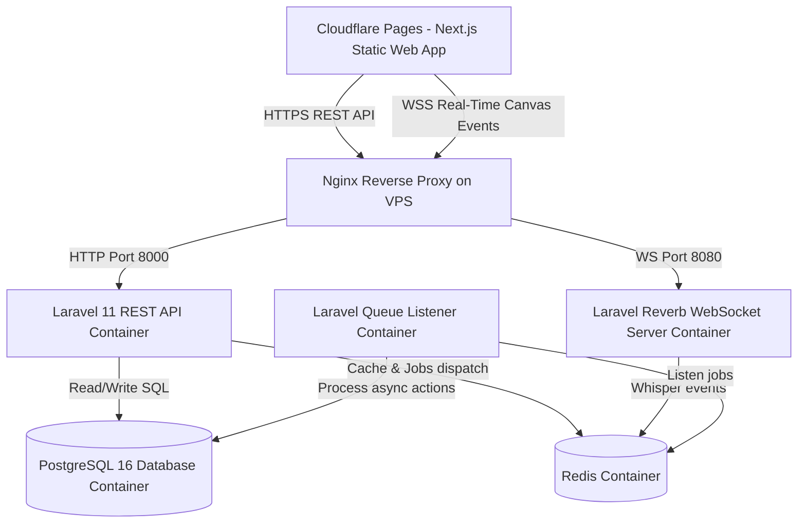

# Kinova - Premium Collaborative Genealogy Canvas 🌳

Kinova is a state-of-the-art, highly interactive, and collaborative family tree (Silsilah) canvas workspace. It enables families to trace their heritage, log historical milestones, and collaborate in real-time.

---

## 🎨 Kinova Design Philosophy & Tech Stack

Kinova is crafted with a warm-monochrome and sage-green design system. It is optimized to feel extremely responsive, visually lightweight, and rich in micro-animations.

* **Frontend Client Workspace**: Next.js 15, React 19, Zustand State Store, and **React Flow** (custom interactive lineage canvas engine).
* **Backend API Framework**: Laravel 11 (REST API, SSE Event streaming).
* **Real-time Synchronization Engine**: Laravel Reverb (high-performance WebSockets broadcast engine, client-to-client drag coordinate whispering).
* **Database & Caching**: PostgreSQL 16 (strict relational tracking), Redis 7 (job queue broker, caching).
* **Deployment Channels**: Cloudflare Pages (Frontend CDN Edge), Docker Compose on VPS (Containerized Backend Stack behind Nginx SSL).

---

## ⚡ Quickstart Guide

To boot and test the full-stack system locally in under 3 minutes, follow our quickstart guides:

* 💻 **Local Development**: [Local Setup Guide](file:///deploy/development.md)
* 🔒 **Production VPS & Cloudflare**: [Production VPS & Cloudflare Pages Guide](file:///deploy/production.md)

---

## 🔌 Complete RESTful API Routes Sheet

The backend service exposes a highly optimized, fully token-secured RESTful interface:

### 1. Authentication Services
| Method | URI Route | Description | Auth Required |
| :--- | :--- | :--- | :--- |
| `POST` | `/api/register` | Create a new user profile | No |
| `POST` | `/api/login` | Authenticate credentials and receive Bearer Token | No |
| `POST` | `/api/logout` | Revoke active Bearer token | Yes |
| `GET` | `/api/user` | Fetch current profile metadata | Yes |

### 2. Family Tree Archives
| Method | URI Route | Description | Auth Required |
| :--- | :--- | :--- | :--- |
| `GET` | `/api/trees` | List all trees owned by or shared with the user | Yes |
| `POST` | `/api/trees` | Create a new family silsilah tree canvas | Yes |
| `GET` | `/api/trees/{id}` | Fetch deep relational details of a specific tree | Yes |
| `PUT` | `/api/trees/{id}` | Update tree settings (e.g. toggle public view) | Yes |
| `DELETE` | `/api/trees/{id}` | Permanently delete tree archive and all relationships | Yes |
| `GET` | `/api/public/trees/{id}` | Fetch public read-only tree (no Auth required) | No |
| `GET` | `/api/trees/{id}/export/{format}`| Download tree export backup (`gedcom` or `json`) | Yes |

### 3. Family Members (Persons)
| Method | URI Route | Description | Auth Required |
| :--- | :--- | :--- | :--- |
| `POST` | `/api/persons` | Create and place a new family node on the canvas | Yes |
| `PUT` | `/api/persons/{id}` | Update biographical fields or UI coordinate positions | Yes |
| `DELETE` | `/api/persons/{id}` | Remove a family member and cascade break relationships | Yes |
| `GET` | `/api/persons/{id}` | Retrieve comprehensive individual milestone logs | Yes |

### 4. Lineage Connections (Relationships)
| Method | URI Route | Description | Auth Required |
| :--- | :--- | :--- | :--- |
| `POST` | `/api/relationships` | Link two family nodes (spouse, parent, sibling, adopted) | Yes |
| `DELETE` | `/api/relationships/{id}`| Break connection and destroy edge permanent link | Yes |

### 5. Research Discussion (Comments)
| Method | URI Route | Description | Auth Required |
| :--- | :--- | :--- | :--- |
| `GET` | `/api/persons/{personId}/comments`| Fetch research notes/comments for a family member | Yes |
| `POST` | `/api/comments` | Post a new research note or archival finding | Yes |
| `DELETE` | `/api/comments/{id}` | Remove research note | Yes |

### 6. Collaborator Permissions
| Method | URI Route | Description | Auth Required |
| :--- | :--- | :--- | :--- |
| `GET` | `/api/trees/{id}/collaborators`| Fetch owners and active users with permission rights | Yes |
| `POST` | `/api/trees/{id}/share` | Invite user (by email) as `editor` or `viewer` | Yes |
| `DELETE` | `/api/collaborators/{id}`| Revoke access and expel collaborator from canvas | Yes |

### 7. Audit Trails & Activity logs
| Method | URI Route | Description | Auth Required |
| :--- | :--- | :--- | :--- |
| `GET` | `/api/trees/{id}/activities`| Stream chronological history logs of modifications | Yes |
