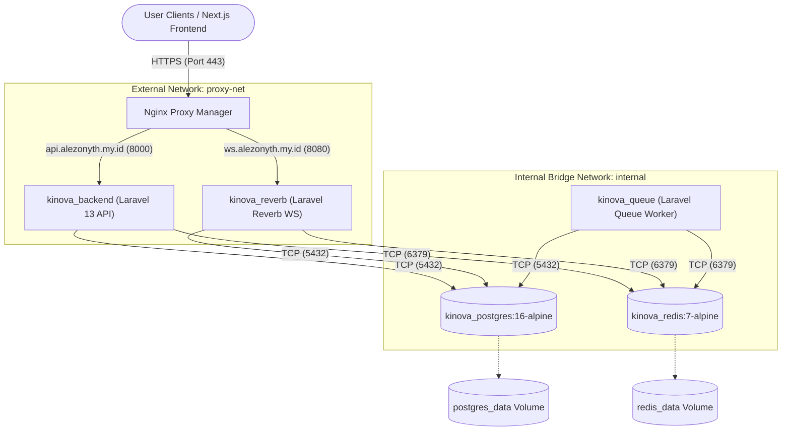

# Kinova Production Stack Setup Guide

This guide describes the complete workflow to deploy the Kinova production backend stack onto a Virtual Private Server (VPS) that utilizes **Nginx Proxy Manager (NPM)** as a global reverse proxy, and compile/deploy the Next.js frontend onto **Cloudflare Pages**.

---

## 🏗️ System Architecture Overview



In a production environment:
1. **Next.js Frontend**: Hosted separately on **Cloudflare Pages** (static export) and served globally via Cloudflare CDN.
2. **Nginx Proxy Manager (NPM)**: Already running globally on the VPS, handling wildcard Let's Encrypt certificates (`*.alezonyth.my.id`) via Cloudflare DNS challenge. Only ports `80` and `443` are exposed publicly.
3. **Kinova Backend Services**: Built in isolated Docker containers:
   - Only `backend` and `reverb` containers join the external `proxy-net` network to be reachable by NPM.
   - `postgres`, `redis`, and the `queue` worker remain inside an isolated internal bridge network (`internal`) and are **never** exposed to the public internet.

---

## 🔒 Part 1: Production VPS Backend Deployment

### 1. Prerequisites
- A VPS running with Docker and Docker Compose.
- **Nginx Proxy Manager (NPM)** running inside a Docker network named `proxy-net`. If the network does not exist yet, create it on the VPS:
  ```bash
  docker network create proxy-net
  ```

### 2. Clone the Repository
Clone the codebase into the target production web root:
```bash
sudo mkdir -p /var/www/family-trees
sudo chown -R $USER:$USER /var/www/family-trees
git clone https://github.com/MalvinMs/family-trees.git /var/www/family-trees
cd /var/www/family-trees
```

### 3. Configure Laravel Production Environment
Copy the production environment template to `.env` in the root folder:
```bash
cp .env.prod.example .env
nano .env
```

Define all the required secrets and variables inside the `.env` file:
```env
APP_NAME=Kinova
APP_ENV=production
APP_DEBUG=false
APP_KEY=base64:YOUR_SECURE_RANDOM_GENERATED_APP_KEY # Run 'php artisan key:generate' on dev to generate
APP_URL=https://api.alezonyth.my.id
FRONTEND_URL=https://kinova.alezonyth.my.id # Cloudflare Pages domain (CORS)

DB_CONNECTION=pgsql
DB_HOST=postgres
DB_PORT=5432
DB_DATABASE=kinova_production
DB_USERNAME=kinova_prod_user
DB_PASSWORD=YOUR_HIGH_SECURITY_DATABASE_PASSWORD

REDIS_HOST=redis
REDIS_PORT=6379
REDIS_PASSWORD=YOUR_HIGH_SECURITY_REDIS_PASSWORD

QUEUE_CONNECTION=redis

BROADCAST_CONNECTION=reverb

REVERB_APP_ID=kinova_prod_app_id
REVERB_APP_KEY=kinova_prod_app_key
REVERB_APP_SECRET=kinova_prod_app_secret
REVERB_HOST=ws.alezonyth.my.id
REVERB_PORT=8080
REVERB_SCHEME=https

PHP_CLI_SERVER_WORKERS=4
```

> [!IMPORTANT]
> Change the `APP_KEY`, `DB_PASSWORD`, `REDIS_PASSWORD`, and Reverb details with unique, randomly-generated credentials before launching.

---

### 4. Deploy and Run the Stack
We have automated the deployment pipeline using a bash script. The deployment script handles pulling the latest code from GitHub, rebuilding images without cache, ensuring database health, running migrations, caching Laravel assets, and restarting containers gracefully.

Make the script executable and run it:
```bash
chmod +x deploy.sh
./deploy.sh
```

#### What the deploy script does under the hood:
1. Performs `git pull origin main` to pull latest changes.
2. Rebuilds production images with zero-cache (`docker compose -f docker-compose.prod.yml build --no-cache`).
3. Boots up `postgres` and `redis`, waiting until healthchecks report them as **healthy**.
4. Boots up `backend` and executes forced migrations (`php artisan migrate --force`).
5. Optimizes Laravel performance inside the container (`php artisan optimize` caches config, routes, and views).
6. Gracefully recreates/restarts `backend`, `queue`, and `reverb` services (`docker compose -f docker-compose.prod.yml up -d --force-recreate`).
7. Prunes dangling Docker build images to keep VPS storage clean (`docker image prune -f`).

---

### 5. Configure Nginx Proxy Manager (NPM) GUI

To expose the services, log in to your Nginx Proxy Manager dashboard and add the following two Proxy Hosts:

#### A. API Routing Host (`api.alezonyth.my.id`)
* **Detail Tab**:
  - **Domain Names**: `api.alezonyth.my.id`
  - **Scheme**: `http`
  - **Forward Hostname / IP**: `kinova_backend` *(Docker container name)*
  - **Forward Port**: `8000`
  - **Block Common Exploits**:  *On*
  - **Websockets Support**: ❌ *Off*
* **SSL Tab**:
  - **SSL Certificate**: Select the existing wildcard certificate `*.alezonyth.my.id`
  - **Force SSL**:  *On*
  - **HTTP/2 Support**:  *On*
  - **HSTS Enabled**:  *On*

#### B. WebSocket Routing Host (`ws.alezonyth.my.id`)
* **Detail Tab**:
  - **Domain Names**: `ws.alezonyth.my.id`
  - **Scheme**: `http`
  - **Forward Hostname / IP**: `kinova_reverb` *(Docker container name)*
  - **Forward Port**: `8080`
  - **Block Common Exploits**:  *On*
  - **Websockets Support**:  *On (CRITICAL - enables WebSocket Connection upgrades)*
* **SSL Tab**:
  - **SSL Certificate**: Select the existing wildcard certificate `*.alezonyth.my.id`
  - **Force SSL**:  *On*
  - **HTTP/2 Support**:  *On*
  - **HSTS Enabled**:  *On*
* **Advanced Tab**:
  Paste the following custom block inside the **Custom Nginx Configuration** text area. This disables response buffering (ensures real-time push latency) and prevents Nginx from severing idle WebSocket connections:
  ```nginx
  proxy_http_version 1.1;

  # Forward proper protocol properties
  proxy_set_header Host $http_host;
  proxy_set_header Scheme $scheme;
  proxy_set_header SERVER_PORT $server_port;
  proxy_set_header REMOTE_ADDR $remote_addr;
  proxy_set_header X-Forwarded-For $proxy_add_x_forwarded_for;

  # Handshake upgrade lines
  proxy_set_header Upgrade $http_upgrade;
  proxy_set_header Connection "Upgrade";

  # Performance optimizations for WebSockets
  proxy_buffering off;
  proxy_read_timeout 86400s; # Keep connection open up to 24 hours without message activity
  proxy_send_timeout 86400s;
  ```

---

## ⚡ Part 2: Cloudflare Pages Frontend Deployment

Deploying the Next.js static application on Cloudflare Pages guarantees low latency and global edge acceleration.

### 1. Set Up Static Exports Config
Ensure `/frontend/next.config.js` or `next.config.mjs` is configured to render static-site builds (`output: 'export'`) with unoptimized images:
```javascript
/** @type {import('next').NextConfig} */
const nextConfig = {
  output: 'export',
  images: {
    unoptimized: true, // Required for Next.js static exports
  },
};
export default nextConfig;
```

### 2. Connect Your Git Repo to Cloudflare
1. Log into your **Cloudflare Dashboard**.
2. Go to **Workers & Pages** -> **Create Application** -> **Pages** -> **Connect to Git**.
3. Select your repository containing the genealogy tree codebase.

### 3. Configure Pages Build Settings
Define these parameters during the connection wizard:
* **Project Name**: `kinova-genealogy`
* **Production Branch**: `main`
* **Framework Preset**: `Next.js (Static HTML Export)`
* **Build Command**: `npm run build`
* **Build Output Directory**: `frontend/out`
* **Root Directory**: `frontend`

### 4. Inject Production Environmental Variables
Navigate to your Cloudflare Pages project **Settings** -> **Environment Variables** and add:
* `NEXT_PUBLIC_API_URL` = `https://api.alezonyth.my.id` (Your secure VPS API domain)

### 5. Deploy
Click **Save and Deploy**. Cloudflare compiles your Next.js application into static files and serves them across their globally distributed CDN edges. You can easily bind a custom domain (e.g., `kinova.alezonyth.my.id`) in the **Custom Domains** tab.
