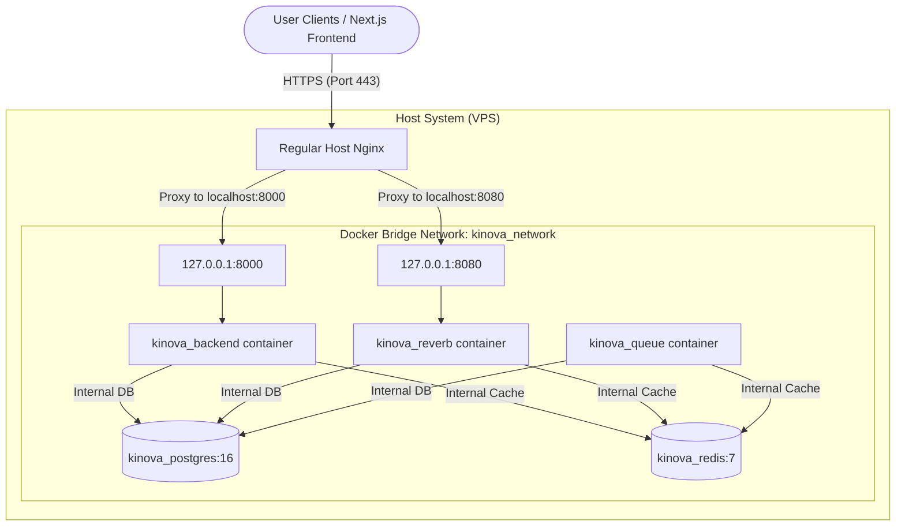

# Kinova Production Deployment Guide (Fresh VPS Setup)

This document is a comprehensive, step-by-step guide to deploying the Kinova backend stack on a brand-new, freshly installed Ubuntu VPS (e.g., Ubuntu 22.04 LTS or 24.04 LTS).

Instead of using Nginx Proxy Manager, this guide utilizes **regular, host-level Nginx** as the reverse proxy and **Let's Encrypt Certbot** for SSL termination.

---

## 🏗️ System Architecture Overview



To ensure strict security, **only Host Nginx is exposed to the public internet** (ports 80 and 443). The backend API and Reverb containers bind their ports strictly to `127.0.0.1` (localhost), ensuring they cannot be accessed directly from the outside, bypassing Nginx.

---

## 🚀 Step-by-Step VPS Setup

### Step 1: Connect to your Fresh VPS
Connect to your VPS server via SSH from your local terminal:
```bash
ssh ubuntu@YOUR_VPS_IP
```

---

### Step 2: System Update and Package Installation
Update the VPS package manager and install essential packages (Git, regular Nginx, Certbot, and Python SSL integration):
```bash
sudo apt update && sudo apt upgrade -y
sudo apt install -y git nginx certbot python3-certbot-nginx curl ca-certificates
```

---

### Step 3: Install Docker Engine
Install Docker and Docker Compose using Docker's official GPG and Apt repository:

```bash
# 1. Add Docker's official GPG key
sudo install -m 0755 -d /etc/apt/keyrings
sudo curl -fsSL https://download.docker.com/linux/ubuntu/gpg -o /etc/apt/keyrings/docker.asc
sudo chmod a+r /etc/apt/keyrings/docker.asc

# 2. Add the repository to Apt sources
echo \
  "deb [arch=$(dpkg --print-architecture) signed-by=/etc/apt/keyrings/docker.asc] https://download.docker.com/linux/ubuntu \
  $(. /etc/os-release && echo "$VERSION_CODENAME") stable" | \
  sudo tee /etc/apt/sources.list.d/docker.list > /dev/null

# 3. Update the package manager and install Docker packages
sudo apt update
sudo apt install -y docker-ce docker-ce-cli containerd.io docker-buildx-plugin docker-compose-plugin
```

To run Docker commands without needing `sudo` every time, add your current shell user to the `docker` group:
```bash
sudo usermod -aG docker $USER
# Activate the group changes immediately
newgrp docker
```
*Verify Docker is running:* `docker --version` and `docker compose version`

---

### Step 4: Clone the Codebase
Create a dedicated deployment directory and clone your repository:
```bash
sudo mkdir -p /var/www/family-trees
sudo chown -R $USER:$USER /var/www/family-trees
git clone https://github.com/MalvinMs/family-trees.git /var/www/family-trees
cd /var/www/family-trees
```

---

### Step 5: Configure Laravel Production Environment
Copy the production environment variables template to `.env` in the root folder:
```bash
cp .env.prod.example .env
nano .env
```

Configure all your production environment values. Replace database passwords, Redis passwords, App Key, and Reverb secrets with high-security random keys:
```env
APP_NAME=Kinova
APP_ENV=production
APP_DEBUG=false
APP_KEY=base64:YOUR_SECURE_RANDOM_GENERATED_APP_KEY
APP_URL=https://api.alezonyth.my.id
FRONTEND_URL=https://kinova.alezonyth.my.id # Next.js frontend on Cloudflare Pages (CORS)

DB_CONNECTION=pgsql
DB_HOST=postgres
DB_PORT=5432
DB_DATABASE=kinova_production
DB_USERNAME=kinova_prod_user
DB_PASSWORD=YOUR_HIGH_SECURITY_DATABASE_PASSWORD

REDIS_HOST=redis
REDIS_PORT=6379
REDIS_PASSWORD=YOUR_HIGH_SECURITY_REDIS_PASSWORD

QUEUE_CONNECTION=redis

BROADCAST_CONNECTION=reverb

REVERB_APP_ID=kinova_prod_app_id
REVERB_APP_KEY=kinova_prod_app_key
REVERB_APP_SECRET=kinova_prod_app_secret
REVERB_HOST=ws.alezonyth.my.id
REVERB_PORT=8080
REVERB_SCHEME=https

PHP_CLI_SERVER_WORKERS=4
```

---

### Step 6: Trigger the Automated Deployment
We have built an automated deployment script to handle container builds, database migrations, configuration caching, and graceful service restarts.

Make the script executable and run it:
```bash
chmod +x deploy.sh
./deploy.sh
```
This runs the entire build sequence and checks container health. You can verify that all 5 services are running and listening strictly locally:
```bash
docker ps
```
You will see that:
- `kinova_backend` is listening on `127.0.0.1:8000->8000/tcp`.
- `kinova_reverb` is listening on `127.0.0.1:8080->8080/tcp`.

---

### Step 7: Configure Host Nginx Virtual Host
Create a custom Nginx configuration to reverse-proxy traffic to your Docker containers and properly handle WebSocket upgrades:

```bash
sudo nano /etc/nginx/sites-available/kinova
```

Paste the following configurations. Replace `api.alezonyth.my.id` and `ws.alezonyth.my.id` with your exact subdomains:

```nginx
# =============================================================================
# 1. API Reverse Proxy (api.alezonyth.my.id)
# =============================================================================
server {
    listen 80;
    server_name api.alezonyth.my.id;

    location / {
        proxy_pass http://127.0.0.1:8000;
        proxy_http_version 1.1;
        
        proxy_set_header Host $host;
        proxy_set_header X-Real-IP $remote_addr;
        proxy_set_header X-Forwarded-For $proxy_add_x_forwarded_for;
        proxy_set_header X-Forwarded-Proto $scheme;
    }
}

# =============================================================================
# 2. Reverb WebSockets Reverse Proxy (ws.alezonyth.my.id)
# =============================================================================
server {
    listen 80;
    server_name ws.alezonyth.my.id;

    location / {
        proxy_pass http://127.0.0.1:8080;
        proxy_http_version 1.1;
        
        # Connection upgrades for WebSockets
        proxy_set_header Upgrade $http_upgrade;
        proxy_set_header Connection "Upgrade";
        
        # Standard proxy parameters
        proxy_set_header Host $host;
        proxy_set_header X-Real-IP $remote_addr;
        proxy_set_header X-Forwarded-For $proxy_add_x_forwarded_for;
        proxy_set_header X-Forwarded-Proto $scheme;

        # Disable response buffering for real-time WebSockets
        proxy_buffering off;
        proxy_read_timeout 86400s;
        proxy_send_timeout 86400s;
    }
}
```

Enable the site, check the syntax, and reload Nginx:
```bash
sudo ln -s /etc/nginx/sites-available/kinova /etc/nginx/sites-enabled/
sudo nginx -t
sudo systemctl reload nginx
```

---

### Step 8: Acquire SSL Certificates with Certbot Let's Encrypt
Automatically configure HTTPS and request SSL certificates using Certbot:
```bash
sudo certbot --nginx -d api.alezonyth.my.id -d ws.alezonyth.my.id
```

Follow the prompts:
- Provide your email address.
- Agree to the Terms of Service.
- Choose whether to share your email (optional).
- Certbot will automatically negotiate wildcard certificates, verify ownership, update your Nginx configuration with SSL directives, and reload Nginx.

Verify that the system automatic renewal timer is running cleanly:
```bash
sudo systemctl status certbot.timer
```

---

## ⚡ Part 2: Cloudflare Pages Frontend Deployment

Deploying the Next.js static application on Cloudflare Pages guarantees low latency and global edge acceleration.

1. Ensure `/frontend/next.config.js` or `next.config.mjs` is configured to render static static-site builds (`output: 'export'`) with unoptimized images:
   ```javascript
   /** @type {import('next').NextConfig} */
   const nextConfig = {
     output: 'export',
     images: {
       unoptimized: true,
     },
   };
   export default nextConfig;
   ```
2. Log into the **Cloudflare Dashboard** -> **Workers & Pages** -> **Create Application** -> **Pages** -> **Connect to Git**.
3. Select your repository, and set the **Build Settings**:
   - **Framework Preset**: `Next.js (Static HTML Export)`
   - **Build Command**: `npm run build`
   - **Build Output Directory**: `out`
   - **Root Directory**: `frontend`
4. Add the **Environment Variable**:
   - `NEXT_PUBLIC_API_URL` = `https://api.alezonyth.my.id`
5. Click **Save and Deploy**. Once compiled, you can easily bind a custom domain in the **Custom Domains** tab.
